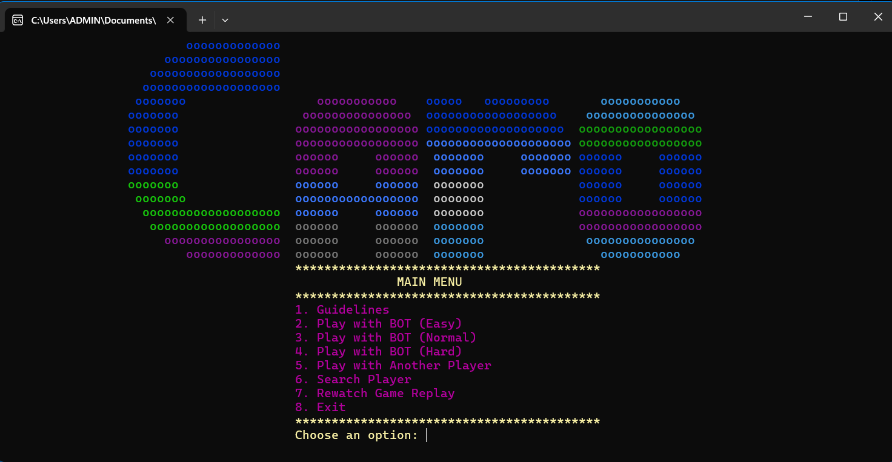
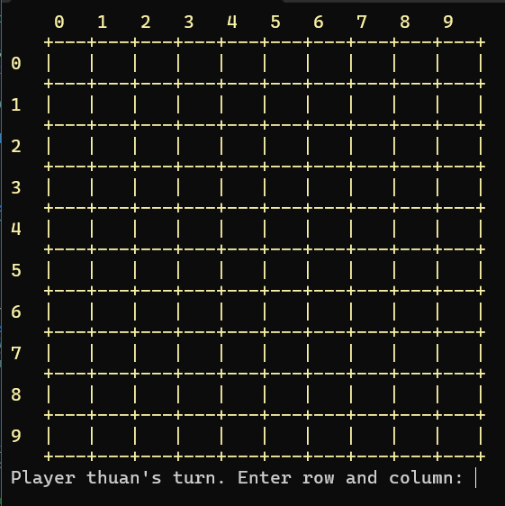

# Tic Tac Toe AI Game

## Overview
This project is a **Tic Tac Toe** game featuring a human player against an intelligent bot powered by the **Minimax Algorithm** with various optimizations for enhanced performance. It offers multiple difficulty levels, replay functionality, and detailed player statistics.

---

## Key Features

### 1. **Player vs Bot Gameplay**
- **Human vs AI**: Play against a smart bot with three difficulty levels:
  - **Easy**: Random moves for casual gameplay.
  - **Normal**: Basic strategies to block and attack.
  - **Hard**: Advanced AI using Minimax and optimizations.
  
### 2. **Player vs Player Mode**
- Compete with another player on the same machine.

### 3. **Player Statistics**
- Tracks wins, losses, and draws for each player.
- Load players history to players.txt
- Suggests potential matches based on player level for balanced gameplay.

### 4. **Replay System**
- Save and rewatch past games with a step-by-step visualization.

### 5. **Customizable UI**
- Enhanced user interface with color-coded game elements:
  - **Red (X)** for human player.
  - **Green (O)** for bot.
  - **Orange** for the board.

### 6. **Guidelines and Help**
- Displays detailed game rules and instructions to assist new players.

---

## Bot Logic
### **Minimax Algorithm**
- The AI evaluates all possible moves to determine the best strategy.
- **Player ("X")**: Maximizes their score.
- **Bot ("O")**: Minimizes the opponent's score.
- **Game Tree:** The algorithm builds a tree representing all possible moves from the current game state.
  - Nodes: Represent the game states after a move.
  - Edges: Represent the moves taken between states.
- **Depth:** Each level of the tree represents a turn in the game.
  - Odd Depths: Maximizer’s turn.
  - Even Depths: Minimizer’s turn.
- **Evaluation Function:** Scores a game state to determine its favorability for the Maximizer
- **Backtracking**: The algorithm calculates scores for each possible move recursively, propagating them back up the tree to determine the best move.

## Optimizations

### 1. **Alpha-Beta Pruning**
- Reduces the number of evaluated game states, making the AI faster.
- Example: Instead of evaluating 1,000,000 states, it may evaluate only 10,000.

### 2. **Transposition Table**
- Stores already-calculated board evaluations for reuse.
- Avoids redundant calculations, reducing runtime significantly.

### 3. **Move Prioritization**
- Focuses on the most critical moves first (e.g., blocking wins), ensuring effective gameplay under time constraints.

### 4. **Dynamic Depth Reduction (Interactive Deepening)**
- Early-game: Analyzes 2–3 moves ahead.
- Late-game: Analyzes up to 5–6 moves ahead for precise endgame strategies.

---

## How to Play

1. **Launch the Game**: Run the executable or compile the project.
2. **Choose Game Mode**:
   - Play against the bot (Easy, Normal, Hard).
   - Play against another player.
3. **Enter Moves**:
   - Input row and column numbers to place your symbol.
   - Bot automatically responds in its turn.
4. **Win Condition**:
   - Align five symbols (X or O) consecutively in any direction.
5. **Replay**:
   - Save or rewatch previous games.
---
## System Requirements

- **Compiler**: C++17 or later.
- **OS**: Windows (uses Windows-specific functions like `SetConsoleTextAttribute`).
- **Libraries**: No external libraries required.

---
